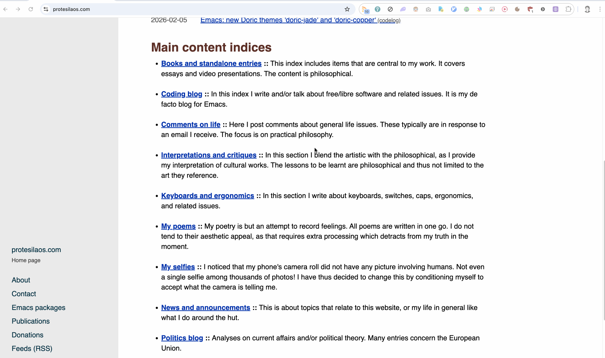

# Chrome to Emacs bridge

A Chrome/Chromium extension that connects Chrome to Emacs. It opens the current
page or a link in [Emacs eww](https://www.gnu.org/software/emacs/manual/html_mono/eww.html),
the built-in Emacs Web "Wowser" [*sic*], and provides a private background-page
bridge for compatible Emacs packages.



## Features

- **Toolbar button** — click the extension icon to open the current tab in eww
- **Context menu** — right-click a link or page to open it in eww
- **Background bridge** — compatible Emacs packages can load an approved URL in
  an inactive tab, read its final DOM, and close only that tab

## Requirements

- [Emacs](https://www.gnu.org/software/emacs/) with a running server
  (`M-x server-start` or `(server-start)` in your init file)
- Python 3
- macOS, Linux, or Windows
- Chrome or Chromium

## Installation

### 1. Clone this repository

```bash
git clone https://github.com/pablostafforini/chrome-to-eww.git
cd chrome-to-eww
```

### 2. Load the extension in Chrome

1. Open `chrome://extensions`.
2. Enable **Developer mode** (top right).
3. Click **Load unpacked** and select the `extension/` subdirectory
   inside the cloned repo.
4. Copy the extension ID shown under the extension name,
   e.g. `lfjhkmagojnhjmfdlfbefcmebodlfcce`.

### 3. Install the native messaging host

The extension needs a small helper program on your machine to
communicate with Emacs. Run the install script from the cloned repo:

**macOS / Linux:**

```bash
./install.sh <extension-id>
```

**Windows** (PowerShell):

```powershell
.\install.ps1 -ExtensionId <extension-id>
```

### 4. Restart the browser

After restarting the browser, clicking on the extension icon or using the context menu should open the current page or link in eww.

Optionally, you may want to associate a keyboard shortcut (e.g. `Ctrl+e` or `⌘+e`) to the "Open in eww" command in `chrome://extensions/shortcuts` for even quicker access.

## How it works

The extension keeps a Chrome native-messaging connection to a small local Python
host. Toolbar and context-menu actions call `emacsclient` to open a URL in eww.
The host also exposes an owner-only Unix-domain socket for approved Emacs
clients. Background requests create tabs with `active: false`; the extension
never focuses a window or selects another tab. The bridge currently accepts only
Anna's Archive search URLs. The background bridge is available on macOS and
Linux; toolbar and context-menu actions also work on Windows.
